# CollaboratiVessel 3D Slicer plugin for microvasculature extraction
By Sean Nachtrab, UCLouvain, 2025-2026

This code repository contains the work done as an update to my repository on [my Gitlab](https://forge.uclouvain.be/SeanNachtrab/msc-thesis-sean-nachtrab)
As a consequence of the 100mb limit of Github, this folder does not contain large files, the list of which can be seen in the .gitignore

My personal blog can be found at http://www.seannachtrab.com/

Please do not hesitate to reach out with questions or for future work. 

### Using & collaborating on this code

This work was intended to be extendable: all required files are packaged with this release. However it could be that future breaking changes occur: if so, and you wish to file a pull request, please submit it on my Git. I loose access to this repository as of Sept 2026.

Feel free to take this plugin and do whatever you want with it.

## Video tutorial:

This video shows ingestion and configuration.

This video shows evaluation and output export to DICOM for interoperability

**To use the plugin (Ubuntu 24.04):** 
1. open /code/3DSlicer and either unzip or use the included distribution with pre-installed Python.
    
    Or use the instructions bellow to install CollaboratiVessel from scratch
2. Load the example data
3. Annotate
4. And validate using the labels.

**To use the plugin (Windows 11):** 
1. Head to the 3D Slicer download page https://download.slicer.org/, and download the most recent windows version. Alternatively, a known good version 5.10 is packaged in this thesis under /code/3DSlicer/Slicer-5.10.0-win-amd64
2. Windows version **requires** following the the *from scratch* instructions bellow 

## Annotated labels

All generated labels can be found under /code/labels/
All manually placed points used during the evaluation of the code can be found under /laels/xxx

**/!\ The sample data requires adjusting the default hyperparameters to work well.**
A vessel size of 8 with a standard deviation of 7 is recommended.
This data, called Sample 5 in the thesis, is here called CA-NM-L_x_900_y_900_z_957
The full correspondence list can be found at the end of this document.

## Installing CollaboratiVessel from scratch

If needed, you may want to install CollaboratiVessel from scratch. To do so:

0. Download 3D Slicer for your specific OS https://download.slicer.org/

---

1. Open the downloaded 3D Slicer. From this step, all points are OS agnostic.

---

2. **(OPTIONAL IF LOADING THE PLUGIN DIRECTLY AS DETAILED IN STEP 3 DOES NOT WORK)** To guarantee a working plugin, open the Python interface and install the following one by one, by copy+pasting and hitting enter:

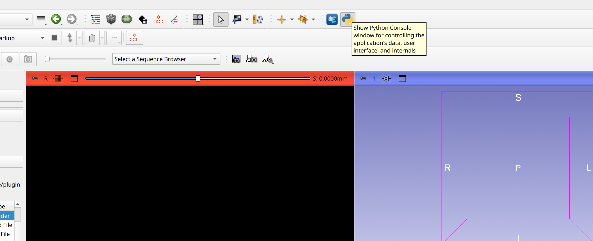

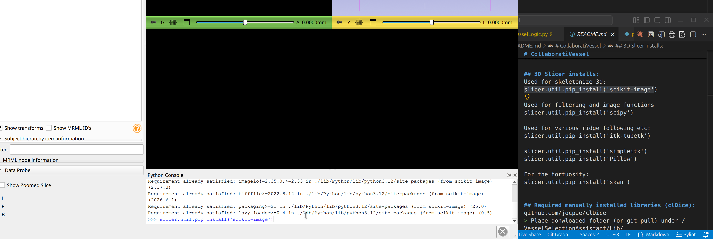

slicer.util.pip_install('scikit-image')

slicer.util.pip_install('scipy')

slicer.util.pip_install('itk-tubetk')

slicer.util.pip_install('simpleitk')

slicer.util.pip_install('Pillow')

slicer.util.pip_install('skan')

---

3. Use the developper extensions to load the plugin:

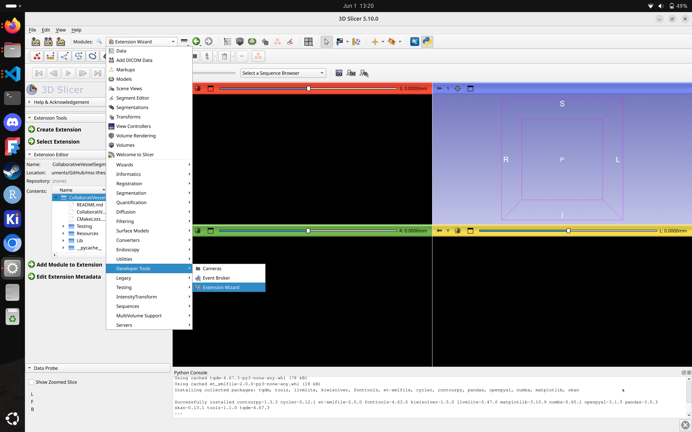

Select the plugin folder **(do NOT select the subfolder, you must select the "plugin")** and hit Choose:

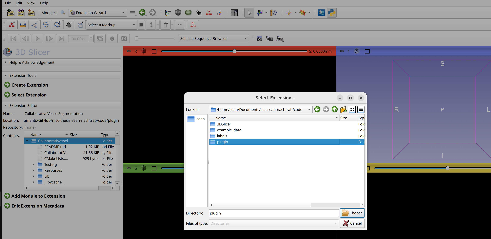

---

4. Find the plugin to validate a correct install:

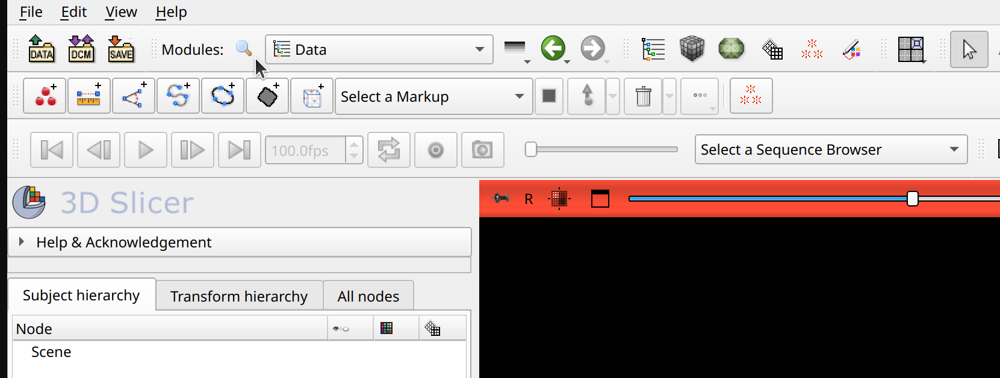

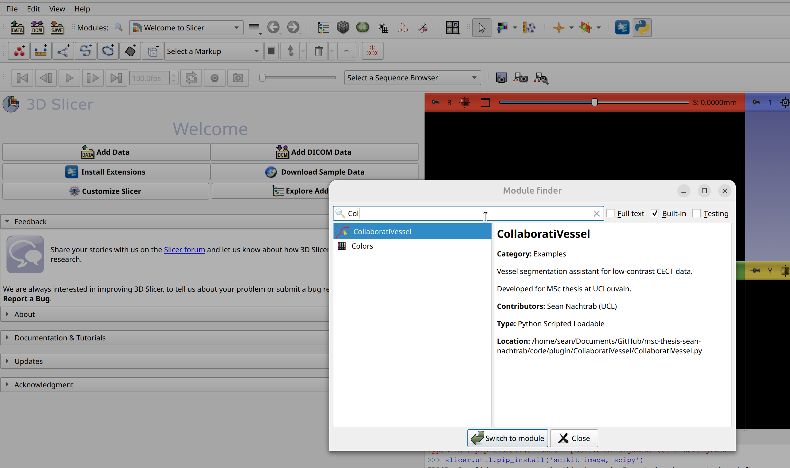

---

5. **Load example data** either (1) from a series of slides or (2) from the included example data.

---

- (1) Slices: press file, Add Data, and add a directory:

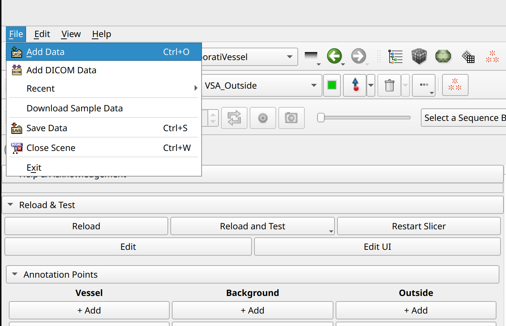

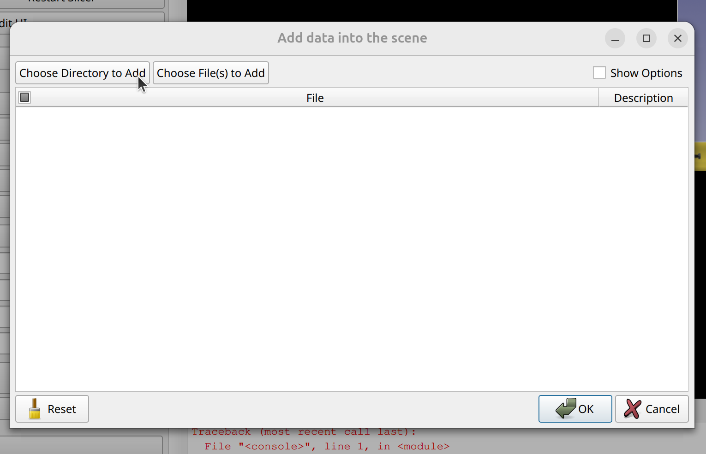

---

- (2) For a DICOM dataset, as the one included in this thesis

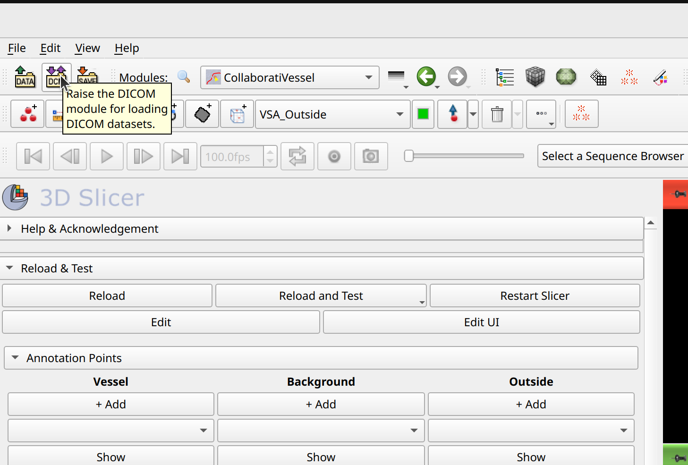

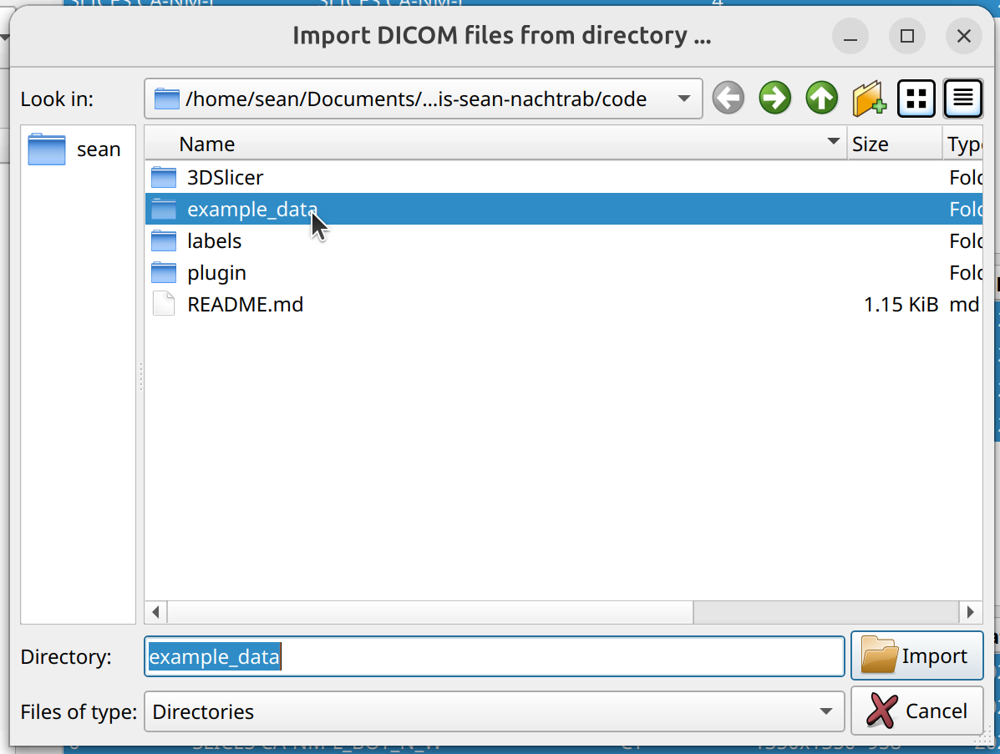
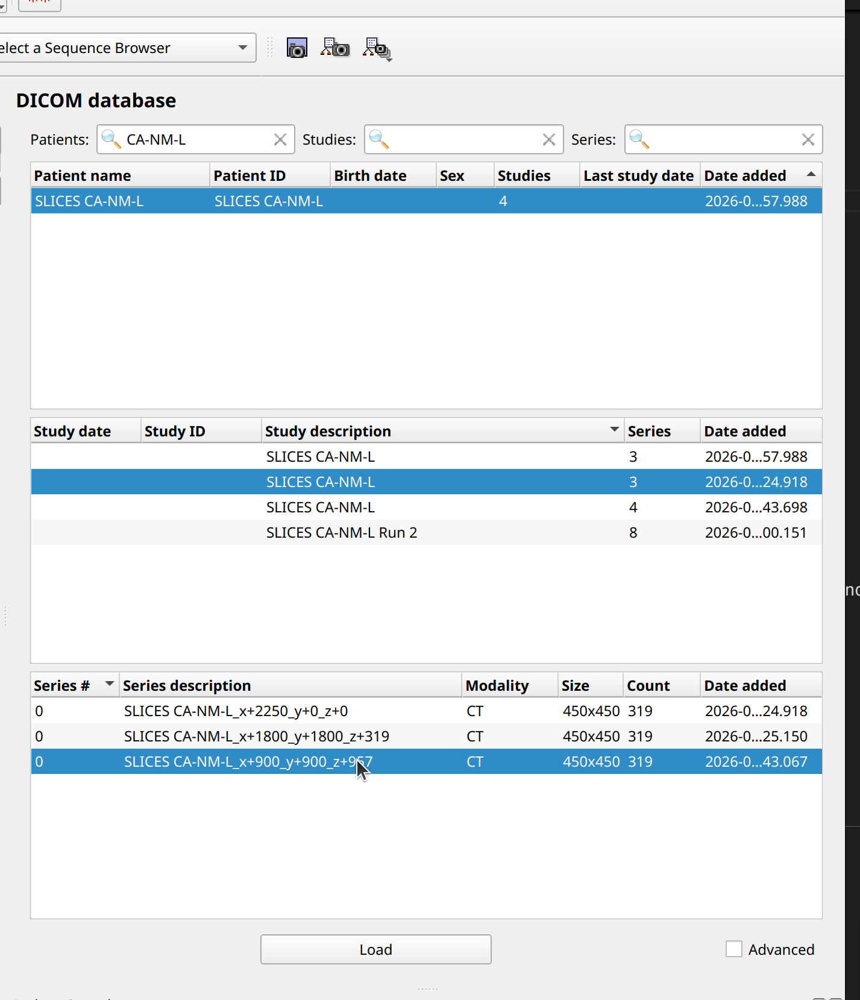

---

6. Once data loading is complete, it will be active. You may use CollaboratiVessel:

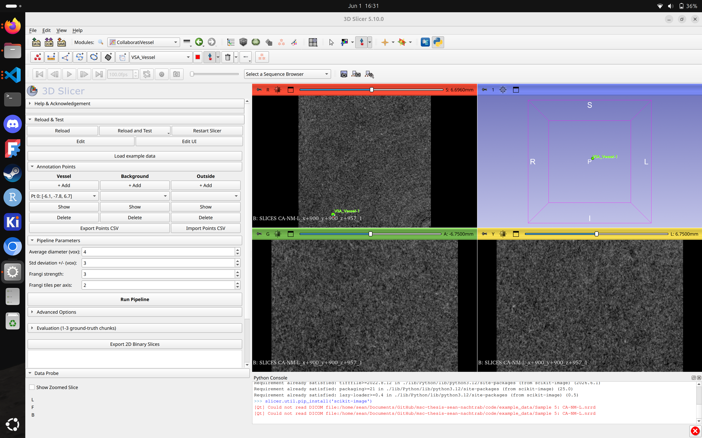

## Correspondence between sample names and "Sample x" in thesis:

- Sample 1: CA-RU-R ending in 222
- Sample 2: CA-RU-R ending in 666
- Sample 3: CA-LL-R ending in 427
- Sample 4: CA-NM-L ending in 319
- Sample 5: CA-NM-L ending in 957
- Sample 6: CA-LL-L1 ending in 498 